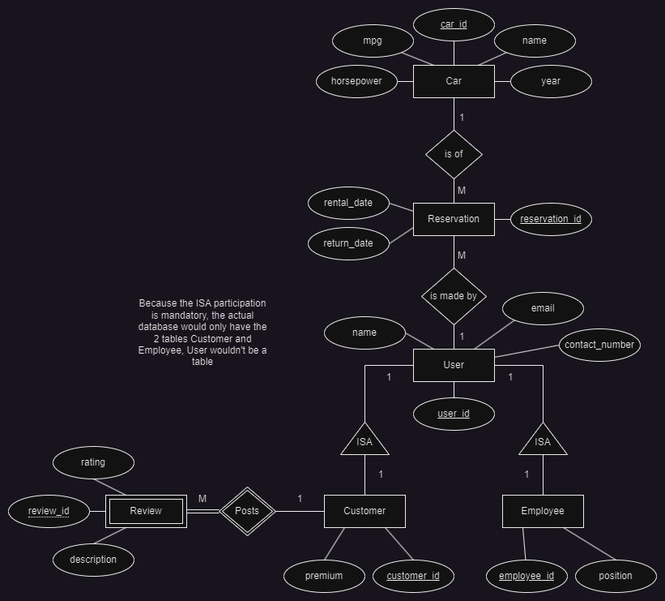

# Report 

## Overview of System

Our database system is designed to facilitate efficient storage and retrieval of data for a variety of purposes, including user management, car inventory tracking, customer relations, and reservation management. The system comprises several interconnected tables, each serving a specific function within the overall framework. The User table stores information about users, including their names, contact numbers, and email addresses. The Car table contains details about different car models, including their years, fuel efficiency (MPG), and horsepower. The Customer table manages customer data, linking them to their respective user profiles and indicating premium status. Additionally, the Employee table tracks employee details, such as their positions within the company. The Reservation table facilitates the booking and management of car rentals, while the Reviews table captures customer feedback and ratings. Together, these components form a robust database system capable of handling diverse data management tasks effectively. Through the utilization of the Faker library, we populated the system with synthetic data, ensuring its readiness for testing, analysis, and deployment in real-world scenarios.

## Data Model

\
In our model (see **Figure 1**), there are two types of users, customers, and employees. Both Customer and Employee have an Is-A relationship with User. A user can only start browsing the available cars once a rental period is input in order to filter the available cars. A same user can make multiple reservations (One-to-Many relationship) and a same car can be the subject of multiple reservations given that there is no overlap in schedule (One-to-Many relationship). Furthermore, a customer can post reviews, which would be a weak entity because if the customer's information gets deleted from the database, so would all the reviews associated with that customer. The same customer can post multiple reviews (One-to-Many relationship).

## Approach 

Our approach to designing and populating the database involved careful planning and systematic execution to ensure the efficient handling of data. We began by identifying the key entities and relationships within the system, laying the foundation for the database schema. Next, we utilized the Faker library to generate data, tailoring it to match the characteristics and constraints of each table. For each table, including User, Car, Customer, Employee, Reservation, and Reviews, we implemented a loop-based process to insert a significant number of rows, aiming to achieve the desired database size of approximately 300 MB. Through iterative testing and refinement, we fine-tuned the data generation process to ensure data integrity and consistency across all tables.

#### Populating the Database Locally
In order to populate the Database locally, you must run the script in the FakerPopulation.py file. At the start of the file, there is a connection variable whose parameters must be edited accordingly to the local database that is setup, i.e host, port, username, password and database name. Once these parameters are set, and the connection is established. The script will run which will populate the database Table by Table. This process does take time, during testing populating the database with this script should take roughly 30 minutes to complete. 

#### Faker.js

In order to generate data for our database that added up to over 300MB, we utilized a library called Faker, which has a version optimized for python. This Library was able to connect directly to the database and after writing a script to set up the generated queries to work with out database tables, it was able to generate data and populate our database. We found that in order to achieve a database of over 300MB, we had to add roughly 550,000 rows per table, totaling roughly 3.5 million total rows in our database. 

## Challenges

#### Database Size
One main challenge we encountered during our project was populating our database. We initially intended to use APIs to populate the database, however we had a hard time finding any. The APIs either required a subscription or were being retired from the market. We then opted for the alternative of using raw datasets sourced online, but the size of our database was only a couple hundred KB, which is very far from the target range. As Previously mentioned, we had to resort to using the Faker library which ran a script to generate copious amounts of mock data in order to satisfy the constraint of a 300MB Database. A peculiarity of MySQL is that the tables Inspections don’t actually update automatically, and that caused us trouble because we did not understand why the data was being populated but the size of our database and the row count in the inspection were not going up. We later learnt that we have to manually tell MySQL to Analyze each individual table and then inspect it to get our updated Properties. 

