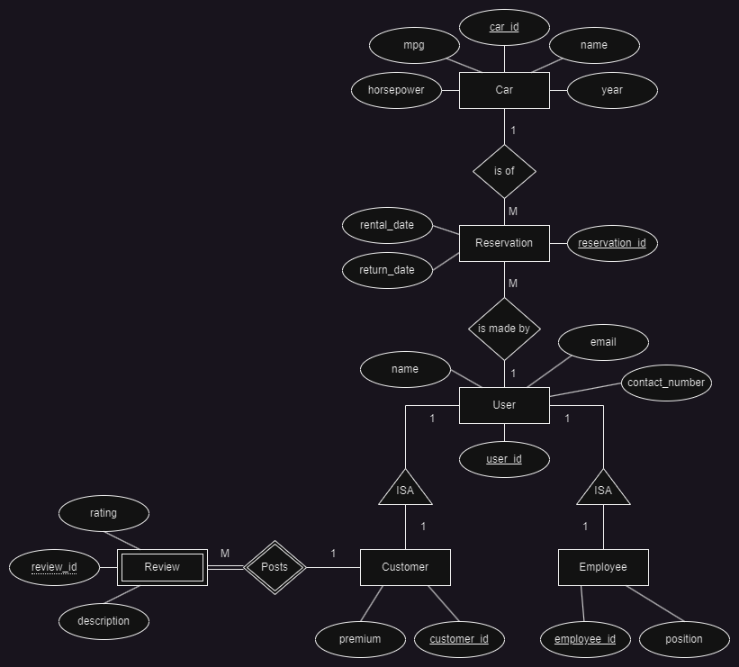

**TO-DO**

..."document that provides an overview of your system as well the data model and the approach / challenges you faces in populating the data"

:(

# Report 

## Overview of System

...

## Data Model

\
In our model, there are two types of users, customers and employees. Both Customer and Employee have an Is-A relationship with User. A user can only start browsing the available cars once a rental period is input in order to filter the available cars. A same user can make multiple reservation (One-to-Many relationship) and a same car can be the subject of multiple reservations given that there is no overlap in schedule (One-to-Many relationship). Furthermore, a cutomer can post reviews, which would be a weak entity because if the customer's information gets deleted from the database, so would all the reviews associated with that customer. A same customer can post multiple reviews (One-to-Many relationship).

## Approach 

#### Populating the Database Locally
In order to populate the Database locally, you must run the script in the FakerPopulation.py file. At the start of the file, there is a connection variable whose parameters must be edited accordingly to the local database that is setup, i.e host, port, username, password and database name. Once these parameters are set, and the connection is established. The script will run which will populate the database Table by Table. This process does take time, during testing populating the database with this script should take roughly 30 minutes to complete. 

#### Faker.js

In order to generate data for our database that added up to over 300MB, we utilized a library called Faker, which has a version optimized for python. This Library was able to connect directly to the database and after writing a script to set up the generated queries to work with out database tables, it was able to generate data and populate our database. We found that in order to achieve a database of over 300MB, we had to add roughly 550,000 rows per table, totaling roughly 3.5 million total rows in our database. 

## Challenges

#### Database Size
One main challenge we encountered during our project was populating our database. We initially intended to use APIs to populate the database, however we had a hard time finding any. The APIs either required a subscription or were being retired from the market. We then opted for the alternative of using raw datasets sourced online, but the size of our database was only a couple hundred KB, which is very far from the target range. As Previously mentioned, we had to resort to using the Faker library which ran a script to generate copious amounts of mock data in order to satisfy the constraint of a 300MB Database. A peculiarity of MySQL is that the tables Inspections don’t actually update automatically, and that caused us trouble because we did not understand why the data was being populated but the size of our database and the row count in the inspection were not going up. We later learnt that we have to manually tell MySQL to Analyze each individual table and then inspect it to get our updated Properties. 

