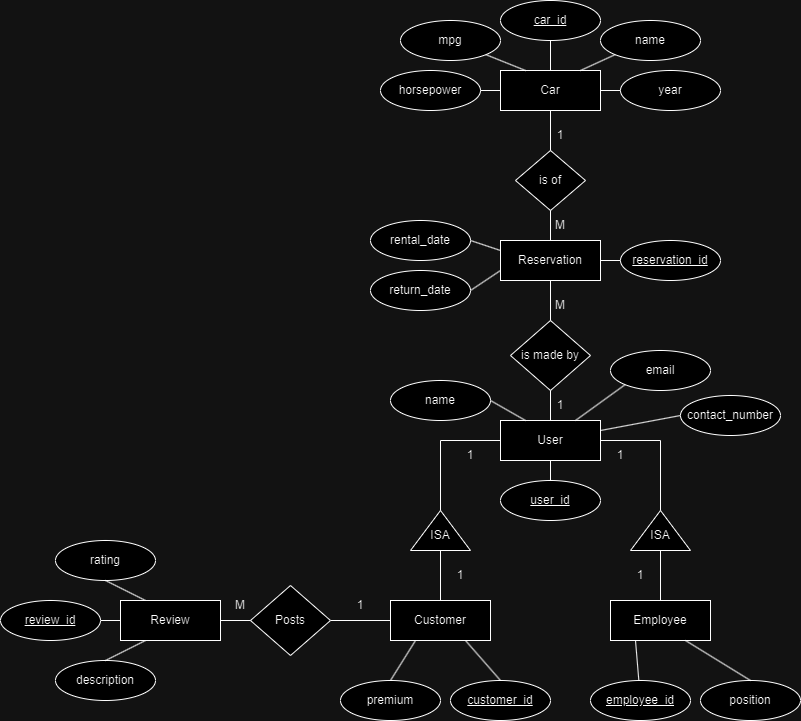

# Report 

## Overview of System

Our database system is designed to facilitate efficient storage and retrieval of data for a variety of purposes, including user management, car inventory tracking, customer relations, and reservation management. The system comprises several interconnected tables, each serving a specific function within the overall framework. The User table stores information about users, including their names, contact numbers, and email addresses. The Car table contains details about different car models, including their years, fuel efficiency (MPG), and horsepower. The Customer table manages customer data, linking them to their respective user profiles and indicating premium status. Additionally, the Employee table tracks employee details, such as their positions within the company. The Reservation table facilitates the booking and management of car rentals, while the Reviews table captures customer feedback and ratings. Together, these components form a robust database system capable of handling diverse data management tasks effectively. Through the utilization of the Faker library, we populated the system with synthetic data, ensuring its readiness for testing, analysis, and deployment in real-world scenarios.

## Data Model

\
In our model (see **Figure 1**), there are two types of users, customers, and employees. Both Customer and Employee have an Is-A relationship with User. A user can only start browsing the available cars once a rental period is input in order to filter the available cars. A same user can make multiple reservations (One-to-Many relationship) and a same car can be the subject of multiple reservations given that there is no overlap in schedule (One-to-Many relationship). Furthermore, a customer can post reviews, but compared to our model from the sql database, reviews do not get automatically delted when a user gets deleted so reviews would not be a weak entity unlike in phase 1.  The same customer can post multiple reviews (One-to-Many relationship).

## Approach 

Our approach to designing and populating the database relied heavily on re-using material from the first phase of the project. After deciding to use a quasi-equivalent data model (apart from the reviews not being a weak entity), we converted the existing population to a csv format and used python to feed the data to MangoDB database hosted online through Atlas. Once it was all set up, we used python again to access the database and create the differewnt queries. In order to facilitate the process of displaying the results of the queries and debugging the queries, we also coded a GUI.

#### Converting The Existing Database Population to CSV Format
In order to populate the Database locally, you must run the script in the FakerPopulation.py file. At the start of the file, there is a connection variable whose parameters must be edited accordingly to the local database that is setup, i.e host, port, username, password and database name. Once these parameters are set, and the connection is established. The script will run which will populate the database Table by Table. This process does take time. Including the blunders, it maybe took two whole days to properly upload the converted files onto the github repository.

#### Faker.js

In order to generate data for our database that added up to over 300MB, we utilized a library called Faker, which has a version optimized for python. This Library was able to connect directly to the database and after writing a script to set up the generated queries to work with out database tables, it was able to generate data and populate our database. We found that in order to achieve a database of over 300MB, we had to add roughly 550,000 rows per table, totaling roughly 3.5 million total rows in our database. 

## Challenges

#### Database Size
One main challenge we encountered during our project was converting the database population to csv format. During the process, we had to tweak some settings to prevent some fields from getting merged. Furthermore, the whole conversion and uploading process was rather time-consuming considering that we weren't able to see if a field was merged or was missing until the conversion of the whole file.

### Data Model Conversion
Since the process of converting our database population had already been lengthy, we did not get to change much to the data model. Although we could have embedded some entities into others, we decided to conserve a more traditional data model that we found still worked with the no-sql schema.

#### Data Visualization
Another challenge we encountered was that it was hard to have a good look at the results of our queries through the terminal. Even in a tabulated format, the sheer length of the data was enough to deter from going through it all. The initial solution was to print the result of each query in a separate external text file, but that would be a lot of files to create and it would feel bulky for the debugging process. What we opted to do was to construct a GUI using python. Although quite primitive, it still allowed us to organize the results of the queries a bit more efficiently.
